  

  

## 📌 About Me
- 🔭 I’m currently working on head of IT YGE
- 🤝 I’m looking for help with C
- 🌱 I’m currently learning C
- 💬 Ask me about Python

## 🧠 My Focus Areas
- ### **Focus Areas**
** Core Technologies & Web Development **
* **Full-Stack Development:** Building applications using HTML, CSS, JavaScript, TypeScript, React, and Node.js.
* **Interactive Projects:** Developing real-time and dynamic web applications (such as weather tracking and interactive user engagement tools).
**System Architecture & Automation**
* **System Customization:** Advanced environment tuning, including Linux desktop customization (ricing) and Bash scripting.
* **Automated Workflows:** Implementing webhooks and integrating REST APIs for dynamic content fetching and self-updating architectures.
**UI/UX & Visual Design**
* **Logic-Driven Design:** Crafting minimalist design systems and intuitive UI/UX frameworks.
* **Visual Communication:** Bridging the gap between professional graphic design and seamless user experiences.
**Tech for Sustainability**
* **Climate Informatics:** Exploring and writing about the intersection of technology and environmental sustainability.
* **Digital Infrastructure:** Managing technical systems and digital advocacy as the Director of IT for Youth for a Green Earth (YGE).

## 📊 GitHub Stats & Trophies

  

  

## 🛠️ Languages & Tools

<h3 align="center">Programming Languages</h3>

  
  
  

<h3 align="center">Frontend</h3>

  
  
  
  
  

<h3 align="center">Backend</h3>

  
  

<h3 align="center">Database</h3>

  

<h3 align="center">DevOps & Cloud</h3>

  
  

<h3 align="center">Tools</h3>

  
  
  
  

 

## 🔗 Connect with Me

  
  
  
  

  

  

